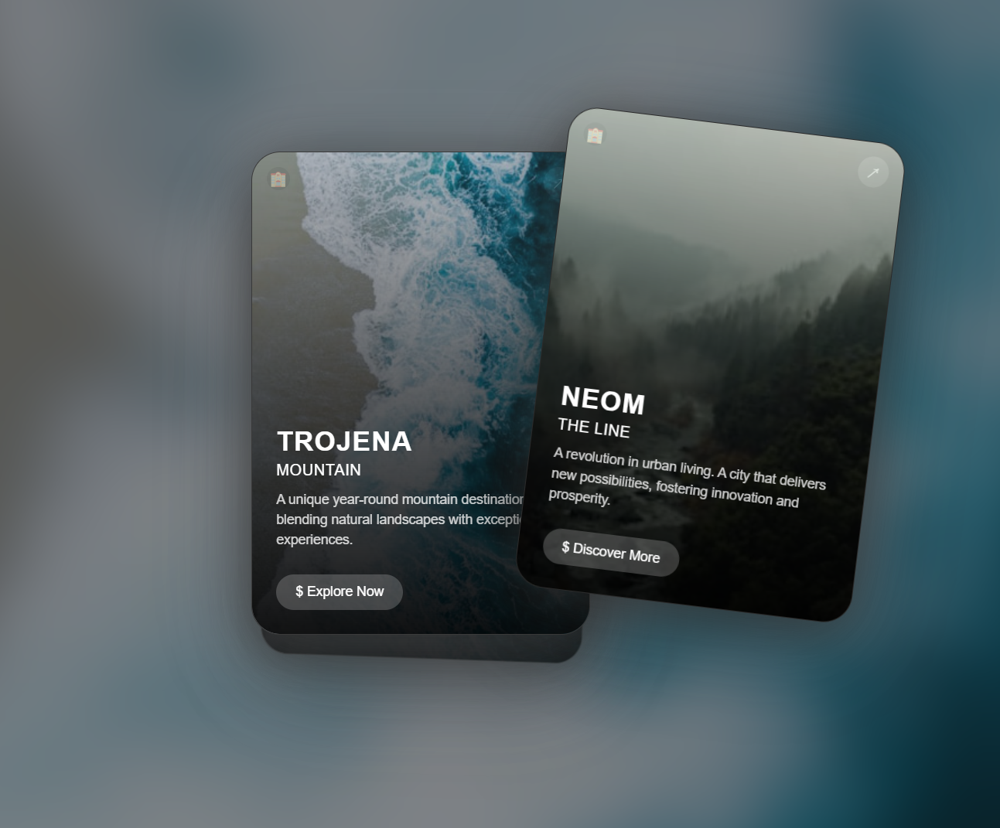
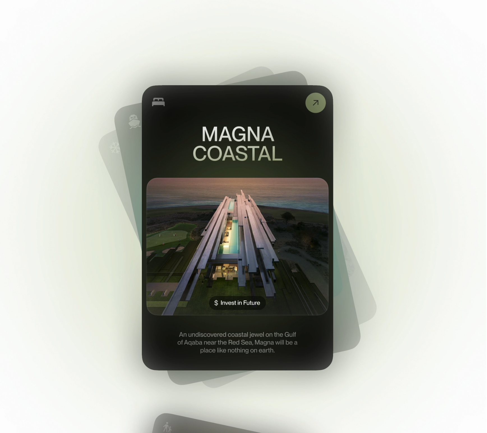

# CardFlow 流畅卡片展示系统

> Powered by Trae AI

## 对标产品的比较

<table>
<tr>
<td width="50%" align="center"><b>CardFlow 效果</b></td>
<td width="50%" align="center"><b>对标产品效果</b></td>
</tr>
<tr>
<td width="50%" align="center"></td>
<td width="50%" align="center"></td>
</tr>
</table>


## 项目简介
CardFlow 是一个现代化的、交互式卡片展示系统，它提供了流畅的滑动动画和精美的视觉效果。项目采用纯原生 JavaScript 实现，无需任何外部依赖，展现了优雅的卡片切换效果和沉浸式的用户体验。

## 功能特点
- 🎯 流畅的多方向滑动交互
- 🎨 动态背景图片切换效果
- 🌈 智能的卡片堆叠与层级管理
- 📱 完整的触摸屏支持
- 🎭 优雅的动画过渡效果
- 🎪 沉浸式的视觉体验
- 🔄 循环展示的卡片系统

## 技术实现

### 核心技术栈
- HTML5
- CSS3
- 原生 JavaScript

### 关键技术点
1. **卡片管理系统**
   - 使用数组管理卡片状态
   - 实现卡片的动态添加与移除
   - 维护固定数量的可见卡片

2. **手势识别系统**
   - 支持鼠标和触摸事件
   - 计算拖动距离和方向
   - 智能判断滑动意图

3. **动画效果系统**
   - 使用 CSS Transform 实现位移和旋转
   - 动态计算过渡效果
   - 平滑的透明度渐变

4. **视觉反馈系统**
   - 动态背景切换
   - 卡片阴影效果
   - 模糊玻璃效果

## 代码结构

```
├── index.html      # 页面结构
├── style.css       # 样式定义
└── script.js       # 核心逻辑
```

### 核心模块

1. **初始化模块**
   - `initializeCards()`: 初始化卡片系统
   - `createCardElement()`: 创建卡片元素
   - `addEventListeners()`: 绑定事件监听

2. **交互控制模块**
   - `dragStart()`: 开始拖动处理
   - `drag()`: 拖动过程处理
   - `dragEnd()`: 结束拖动处理

3. **动画效果模块**
   - `updateCardPositions()`: 更新卡片位置
   - `resetCardPositions()`: 重置卡片位置
   - `setTranslate()`: 设置变换效果

4. **卡片管理模块**
   - `addNewCard()`: 添加新卡片
   - `addPrevCard()`: 添加前一张卡片
   - `updateBackgroundImage()`: 更新背景图片

## 使用说明

1. **基本使用**
   - 直接打开 index.html 即可运行
   - 支持现代浏览器（Chrome、Firefox、Safari、Edge）

2. **交互方式**
   - 鼠标拖拽
   - 触摸屏滑动
   - 支持任意方向的滑动手势

3. **自定义配置**
   可以通过修改以下常量来自定义效果：
   ```javascript
   const CARD_SPACING = 25;    // 卡片间距
   const THRESHOLD = 150;      // 滑动阈值
   const VISIBLE_CARDS = 3;    // 可见卡片数
   const ROTATION_ANGLE = 7;   // 旋转角度
   ```

## 性能优化
- 使用 CSS Transform 实现动画效果
- 优化 DOM 操作频率
- 使用 requestAnimationFrame 优化动画性能
- 实现卡片元素的循环利用

## 后续优化方向
1. 添加更多的交互效果
2. 优化移动端性能
3. 增加更多的自定义选项
4. 支持更多的卡片内容类型
5. 添加更多的动画效果

## 贡献指南
欢迎提交 Issue 和 Pull Request 来帮助改进项目。

## 许可证
MIT License